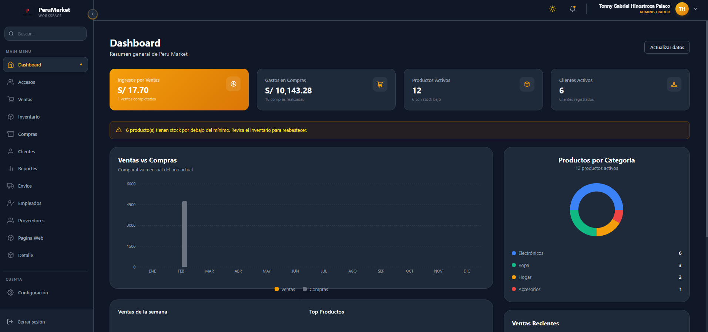
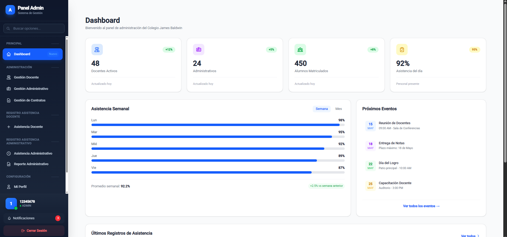
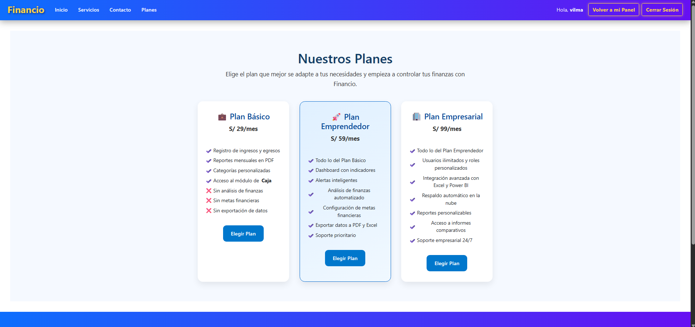

# 🚀 Tonny Gabriel Hinostroza Palaco - Backend Developer

**Java & Spring Boot | APIs REST | Clean Architecture | Full Stack**

[Proyectos](#-proyectos-destacados) • [Stack](#-stack-tecnológico) • [Contacto](#-contacto)

---

## 👨‍💻 Perfil Profesional

Desarrollador Backend especializado en **Java** y **Spring Boot** para construir APIs robustas y escalables. Complemento el backend con **React** y **Angular** para soluciones full stack. Aplico **Arquitectura Limpia** y principios **SOLID** para garantizar código mantenible.

**Enfoque técnico:**
- **Arquitectura:** Clean Architecture, Capas (Controller/Service/Repository), Microservicios.
- **Backend:** Java 17, Spring Boot, JPA/Hibernate, JWT, Spring Security.
- **Frontend:** React, Angular, TypeScript, TailwindCSS.
- **Bases de datos:** MySQL, PostgreSQL, MongoDB.
- **Prácticas:** DTOs, Validaciones, JUnit, Mockito.

---

## 🛠️ Stack Tecnológico

| Categoría | Tecnologías |
|-----------|--------------|
| **Backend** | ☕ Java 17, 🌱 Spring Boot, 💾 JPA/Hibernate, 🔐 Spring Security/JWT, 🧪 JUnit/Mockito |
| **Frontend** | ⚛️ React 18, ⚡ Angular 17, 🎨 TailwindCSS, 🧠 TypeScript |
| **BD** | 🐬 MySQL, 🐘 PostgreSQL, 🍃 MongoDB |
| **Herramientas** | 🐙 Git, 📮 Postman, 💡 IntelliJ IDEA, 🐳 Docker (en aprendizaje) |

---

## 🏛️ Buenas Prácticas

- SOLID, Clean Code, DTO Pattern.
- Inyección de dependencias, bajo acoplamiento.
- Validaciones en backend para seguridad y consistencia.

---

## 🚀 Proyectos Destacados

---

### 🛒 ProyPeruMarket – Gestión Comercial

  

**Tecnologías:** React, Vite, TailwindCSS, Java 17, Spring Boot 3, JPA, MySQL, JWT.

**Funcionalidades:**
- CRUD de usuarios con roles (Admin/Empleado).
- Gestión de productos con stock en tiempo real.
- Registro de ventas y cálculo automático.
- Reportes interactivos.

---

### 📊 Sistema de Asistencia Docente

  

**Tecnologías:** Angular, TypeScript, Bootstrap 5, Java, Spring Boot, JPA, MySQL.

**Funcionalidades:**
- Registro diario de asistencia y tardanzas.
- Cálculo automático de descuentos.
- Generación de reportes.
- Integración con planillas.

---

### 💰 FINANCIO – Sistema de Ingresos/Egresos

  

**Tecnologías:** Angular, Bootstrap 5, Java, Spring Boot, MySQL.

**Funcionalidades:**
- Registro de ingresos y egresos.
- Cálculo automático de balance.
- Organización de movimientos financieros.

---

## 📊 GitHub Stats

---

## 🎯 Próximos pasos

- Microservicios avanzados con Spring Cloud.
- Docker y Kubernetes.
- AWS (Certificación Developer).
- Next.js y Node.js.

---

## 📫 Contacto

| Plataforma | Enlace |
|------------|--------|
| 💼 LinkedIn | [linkedin.com/in/TonnyGabrielHinostrozaPalaco](https://linkedin.com/in/TonnyGabrielHinostrozaPalaco) |
| 🐙 GitHub | [github.com/pashko577](https://github.com/pashko577) |
| 📧 Email | tonnyghp577@gmail.com |
| 🌐 Portafolio | [pashko577.github.io](https://pashko577.github.io) |

